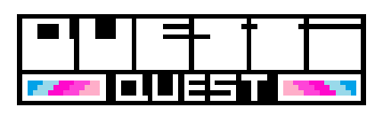
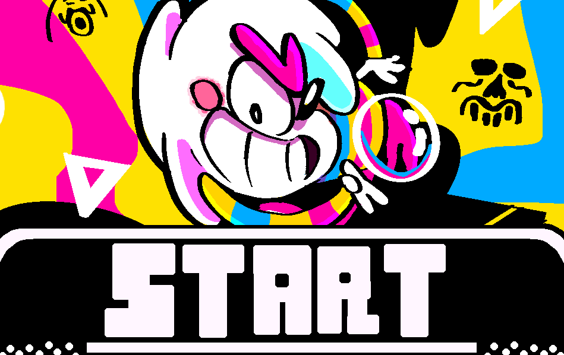

    
     
  </a>

  <a href="https://kudamonolp.github.io/questiquest/">
    
     
  </a>

*(demo: [itch.io](https://kudamonolp.itch.io/questiquest) / [NewGrounds](https://www.newgrounds.com/portal/view/1021735))*
#
[English](#english) | [Italiano](#italiano)
## English
# HOW TO INSTALL 📱

>1. Open [this link](https://kudamonolp.github.io/questiquest/) in **Chrome**.
>2. Tap the **three dots** in the top right corner .
>3. Choose **"Install Application"** or **"Add to Home screen"** .
##

>1. Open [this link](https://kudamonolp.github.io/questiquest/) in **Safari**.
>2. Tap the **three dots** in the bottom right corner .
>3. Tap the **Share** button .
>4. Scroll down and select **"Add to Home Screen"**. 
##

>1. Open [this link](https://kudamonolp.github.io/questiquest/) in **Chrome**, **Safari** or your favorite browser.
>2. Look at the right side of the **address bar** (where the URL is).
>3. Click the **Install icon** .
>4. Click **"Install"**.

## HOW TO PLAY 🕹️
>* On your keyboard use left and right arrow keys to move. Up arrow key to jump (also W,A,D keys) [during Player control].Use your mouse to press buttons, items or input fields.
>* If your screen supports touch controls, you can press buttons, items or input fields.
>* Swipe left and right to move and up to jump [during Player control].
>### CONTROLS
>* keyboard + mouse or touch input.

## Italiano
>## [**AVVIA IL GIOCO**](https://kudamonolp.github.io/questiquest/)

*(Oppure prova la demo su [itch.io](https://kudamonolp.itch.io/questiquest) e/o [NewGrounds](https://www.newgrounds.com/portal/view/1021735))*
# COME SI INSTALLA 📱

>1. Apri [questo link](https://kudamonolp.github.io/questiquest/) in **Chrome**.
>2. Clicca i **tre puntini** in alto a destra .
>3. Scegli **"Installa Applicazione"** o **"Aggiungi a schermata Home"**.
## 

>1. Apri [questo link](https://kudamonolp.github.io/questiquest/) in **Safari**.
>2. Clicca i **tre puntini** in basso a destra .
>3. Clicca su **Condividi** .
>4. Scegli **"Aggiungi a schermata Home"**.

##

>1. Apri [questo link](https://kudamonolp.github.io/questiquest/) in **Chrome**, **Safari** o nel tuo browser preferito.
>2. Guarda la parte destra della **barra d'indirizzo** (dove trovi l'URL).
>3. Clicca sull' **Icona di installazione** .
>4. Clicca su **"Installa"**.

## COME SI GIOCA 🕹️
>* Sulla tastiera, usa i tasti freccia sinistra e destra per muoverti. Usa la freccia su per saltare (anche i tasti W, A, D) [durante il controllo del giocatore]. Usa il mouse per premere pulsanti, oggetti o campi di input.
>* Se lo schermo supporta i comandi touch, è possibile premere pulsanti, elementi o campi di input.
>* Scorri a sinistra e a destra per muoverti e verso l'alto per saltare [durante il controllo del giocatore].
>### CONTROLLI
>* keyboard + mouse o touch input.